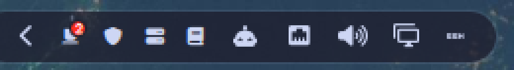
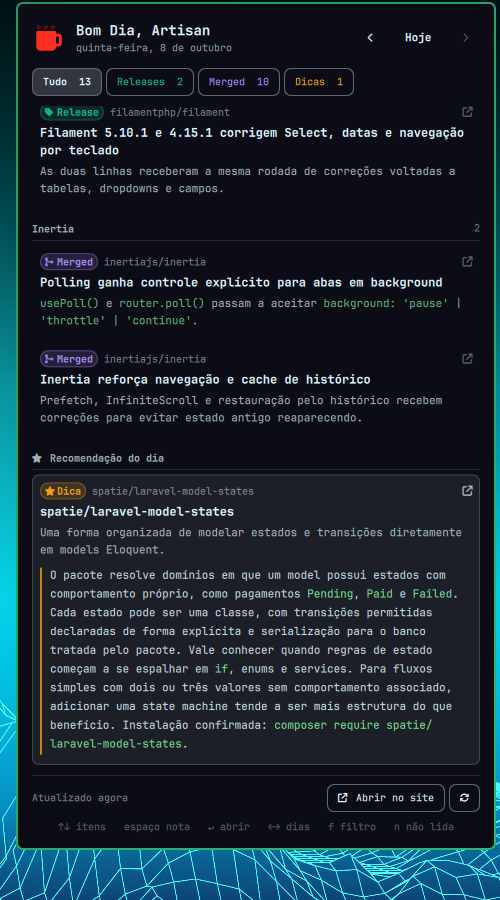

# Bom Dia, Artisan — Omarchy bar widget

The daily Laravel ecosystem digest from [bom-dia-artisan.dev](https://bom-dia-artisan.dev/),
readable from the Omarchy bar.

> Unofficial. Not affiliated with bom-dia-artisan.dev; it reads the site's public
> `/api/reports` once a day.





- **A mug in the bar.** It sits quiet until a new edition lands. Then steam rises off it and a
  Laravel-red dot appears on the rim. When you have missed more than one edition, the dot shows
  how many.
- **The whole edition in the panel.** It shows the editors' summary, the "what is actually
  released vs only merged" note, and every item grouped by package. Each item has a status chip
  (Release, Merged, Dica), its repository, a one-line "why it matters", and the editors' full
  note on demand.
- **The last 16 days** are one arrow key away. An edition counts as read once it has been on
  screen for a moment, not as you arrow past it.
- **A toast for each new edition**, sent once. Clicking it opens the panel. It respects Do Not
  Disturb.
- **Checks once a day**, at 09:30 by default. It's a morning brief, not a ticker.
- **Offline-friendly.** The last answer is cached, so the panel opens instantly and still works
  without a network. The footer says when what you see is the saved copy.

**Contents:** [Install](#install) · [Keys](#keys) · [Settings](#settings) · [IPC](#ipc) ·
[Where things live](#where-things-live) · [Developing](#developing)

## Install

```bash
git clone https://github.com/mmonari/omarchy-bom-dia-artisan.git ~/Projects/Omarchy/Plugins/omarchy-bom-dia-artisan
ln -s ~/Projects/Omarchy/Plugins/omarchy-bom-dia-artisan ~/.config/omarchy/plugins/m0u.artisan
omarchy bar put m0u.artisan              # right section; add --after <id> to place it
omarchy restart shell
```

Needs `curl`, `xdg-open` and `notify-send`. All three come with Omarchy.

## Keys

| Key | Does |
|-----|------|
| `↑` `↓` / `j` `k` | Move between items |
| `Space` | Read the item's full note (again to fold) |
| `Enter` | Open the item's source (GitHub release / PR); with no item selected, the edition on the site |
| `←` `→` / `h` `l` | Previous / next day |
| `f` / `F`, `1`–`4` | Cycle / pick a filter (Tudo, Releases, Merged, Dicas) |
| `n` | Jump to the next unread edition |
| `o` | Open this edition on the site |
| `m` | Mark every edition read |
| `r` | Refresh |
| `g` `G` / `Home` `End` | First / last item |
| `Esc`, `Tab` | Close / move to the neighbouring bar panel |

Mouse: left-click the mug for the panel, middle-click to go straight to today's edition on the
site. In the panel, click the title to open the edition on the site, ↻ beside it to fetch
now, a row to read its note, and a row's ↗ to open the source.

## Settings

Set these on the widget's entry in `~/.config/omarchy/shell.json`, or with
`omarchy bar set m0u.artisan <key> <value>`:

| Key | Default | Meaning |
|-----|---------|---------|
| `checkAt` | `"09:30"` | Local time of the one daily check. The edition is usually out by then. If it isn't, the plugin checks again hourly until it is, then stays quiet until the next morning. If the machine was off or asleep at that time, the check runs as soon as it's back. Opening the panel never fetches; the ↻ button does. |
| `notify` | `"on"` | `"off"` disables the toast. The bar dot still shows unread editions. |

## IPC

```bash
qs -p /usr/share/omarchy/shell ipc call m0u.artisan open|close|toggle|refresh|markAllRead
```

`open`, `close` and `toggle` act on the monitor you are looking at.

## Where things live

| What | Where |
|------|-------|
| Read marks + last announced edition | `~/.local/state/m0u-artisan/state.json` |
| Cached API response | `~/.cache/m0u-artisan/reports.json` |
| Data source | `https://bom-dia-artisan.dev/api/reports`, the same 16 editions as `/feed.xml` with every section and item |

Deleting `state.json` resets the plugin to a first run, where only the newest edition is unread.

---

## Developing

Welcome. The plugin is about 2,100 lines of QML and plain JavaScript. It has no build step and no
npm dependencies, and the git checkout *is* the live plugin, through the symlink from
[Install](#install). You can be productive in it after reading this section.

### Stack

| Layer | Technology |
|-------|------------|
| Runtime | [Quickshell](https://quickshell.org/), the QML engine behind `omarchy-shell`. The plugin uses its `Process`, `FileView` and `IpcHandler` types |
| UI | QML / Qt Quick, plus the shell's own `qs.Commons` (theme tokens) and `qs.Ui` (bar button, panel). Their source is in `/usr/share/omarchy/shell/` |
| Logic | Plain ES5 JavaScript files (`.pragma library`), run by QML's JS engine |
| Data | The site's JSON API, fetched with `curl` |
| Desktop | `notify-send` for the toast, `xdg-open` for links |
| Tests | The Node.js built-in runner (`node --test`), with no test framework |
| Tooling | Python 3 for `tools/escape-glyphs.py`, and `omarchy plugin validate` |

### First 10 minutes

```bash
# 1. Clone and link (see Install). Then check that your setup is healthy:
npm test                        # the node tests + the glyph check, in under a second
omarchy plugin validate .

# 2. Watch the plugin's log while you work
quickshell log --pid $(pgrep -f 'quickshell -n -p /usr/share/omarchy/shell') -t 2000

# 3. Poke it without the mouse
qs -p /usr/share/omarchy/shell ipc call m0u.artisan toggle
```

### Architecture


The design rests on one split. **`BarWidget.qml` is the only file that does I/O.** Every
decision is made in four pure JavaScript files that import nothing from QML. Because of that,
`node --test` loads *the exact files the shell loads*, with no copy and no mock of Qt.

One fetch, start to finish:

1. A 60-second timer in `BarWidget.qml` asks `Source.checkDue()` whether the day's check is
   due. A wall-clock check survives suspend, unlike a long QML `Timer`.
2. If it is due, `BarWidget.qml` runs the argv from `Source.request()` (a `curl` command) and
   hands the output to `Source.parse()`.
3. `Model.normalize()` turns the API response into editions. The widget writes the raw response
   to `reports.json`.
4. `Model.notifyCandidate()` decides whether to toast. If yes, the widget saves `state.json`
   *first*, then runs `Actions.notifyArgv()`.
5. `Model.summarize()` produces the `summary` object. `Mark.qml` draws the mug from it, and
   `Panel.qml` / `ItemRow.qml` draw the edition.

**One widget per monitor.** The shell builds one instance per output. Only the *leader*, the
first entry in `bar.moduleWidgets()`, fetches and notifies. Every instance watches both files
with `FileView` and re-renders when they change. That is how a read mark set on one monitor
shows up on the other.

The diagram source is
[`docs/architecture/architecture.architecture.json`](docs/architecture/architecture.architecture.json).
[`architecture.html`](docs/architecture/architecture.html) is the interactive version, with a
theme toggle and PNG export. Both are made with [Archify](https://github.com/tt-a1i/archify):

```bash
node <archify>/bin/archify.mjs render architecture \
  docs/architecture/architecture.architecture.json docs/architecture/architecture.html
# then open the HTML, Export ▸ SVG, and save it over docs/architecture/architecture.svg
```

### Repository map

```
manifest.json          Plugin manifest: id, entry point, the two settings and their defaults
BarWidget.qml          The widget root. All I/O: curl, the two files, notify-send, xdg-open, IPC
Panel.qml              The popout. Keyboard handling and view state (day, filter, cursor)
ItemRow.qml            One news item: chip, repo, headline, expandable note
StatusChip.qml         The Release / Merged / Dica chip
Mark.qml               The mug in the bar: steam + dot when unread

Model.js               Every rule: normalizing, filters, cursor moves, read marks, notify, wording
Source.js              Transport: the curl argv, response parsing, curl error messages, checkDue
Actions.js             Fixed argv for xdg-open and the toast. Feed text never reaches a shell
Theme.js               Status colours, glyphs and labels, written as \u escapes

test/harness.mjs       Loads the .js files above into node, stripping only .pragma/.import
test/*.test.mjs        The tests (model, source; actions and theme live in source.test.mjs)
test/fixtures/         reports.json: 4 editions from a real /api/reports response (2026-10-08)
tools/escape-glyphs.py Rewrites literal Nerd Font glyphs as escapes. --check fails on any
assets/                logo.png, the toast icon
docs/architecture/     The diagram: JSON source, interactive HTML, SVG for this README
docs/preview-*.png     The screenshots at the top of this README
docs/changelogs/       One file per day of finished work
docs/lessons-learned/  Gotchas worth remembering, one file per theme (committed in this repo)
CLAUDE.md              The rules that are easy to break, written for AI agents and humans alike
```

### Where to make a change

| You want to… | Edit | Then |
|--------------|------|------|
| Change what counts as unread, a filter, cursor behaviour, a label | `Model.js` | add a test in `test/model.test.mjs` |
| Change when or how it fetches | `Source.js` | add a test in `test/source.test.mjs` |
| Change a status colour or icon | `Theme.js` | run `tools/escape-glyphs.py` |
| Change the panel layout or a key binding | `Panel.qml` / `ItemRow.qml` | `omarchy restart shell` |
| Change the bar icon | `Mark.qml` | `omarchy restart shell` |
| Add a setting | `manifest.json` (defaults + schema), read it in `BarWidget.qml` via `root.setting()` | validate, restart |
| Add an IPC verb | the `IpcHandler` in `BarWidget.qml` | restart |

If a rule could live in either a `.qml` or a `.js` file, put it in the `.js` file, where a test
can reach it.

### The dev loop

| You changed | To see it |
|-------------|-----------|
| A `.js` file | `npm test`. The shell needs `omarchy restart shell` too |
| A `.qml` file | `omarchy restart shell`. Saving does **not** reload a bar widget |
| `shell.json` settings | Nothing. Settings hot-reload |
| `state.json` by hand | Nothing. The file watch picks it up |

Run `npm test` before every commit.

### Rules that are easy to break

The full list, with the reasons, is in [`CLAUDE.md`](CLAUDE.md). The short version:

- **Only `BarWidget.qml` does I/O.** Keep the `.js` files free of QML imports, or node can't
  load them.
- **Write Nerd Font glyphs as `\uXXXX` escapes**, with surrogate pairs above U+FFFF. A literal
  private-use character renders as nothing. Editors and heredocs often turn escapes back into
  literals, so run `tools/escape-glyphs.py` after editing. `npm test` fails on a literal glyph.
- **Only the leader fetches, writes the cache and notifies.** Never add a second writer.
- **IPC lands on whichever instance registered first.** An IPC method that touches a panel
  must go through `runOnFocused`.
- **`opened`, `open()`, `close()` and `popoutSwitchClosing` on the widget root are a contract.**
  If any is missing, the bar silently skips the widget for Tab and SUPER+CTRL+`<n>`.
- **QML's `Array.sort` is not stable** (Node's is, so tests can't catch it). To reorder by a
  boolean, use `filter` + `concat`.
- **Row hover uses `onPositionChanged`, never `onEntered`**, so a list scrolling under a
  resting pointer doesn't steal the keyboard cursor.
- **Nothing grows or appears on selection.** Otherwise the list jumps on every arrow key.

### Testing

`test/harness.mjs` reads each `.js` file, blanks its `.pragma` / `.import` lines (keeping line
numbers intact), and evaluates it in node's own realm. That realm choice matters:
`assert.deepEqual` would otherwise fail on cross-realm arrays. Tests run against
`test/fixtures/reports.json`, four editions (31 items) from a real API response, trimmed so the
repo does not republish the site's archive. It includes an older edition with no `status`
field, which `Model.inferStatus` handles. If you replace the fixture, update the tests that pin
those counts in the same commit.

### Verifying UI changes

- `wtype` can't drive the panel: its key events never reach the layer-shell surface. Instead,
  add a temporary IPC method that finds the *opened* panel and calls its own functions
  (`moveCursor`, `activate`, `stepEdition`, `setFilter`, `cursorToEnd`). Remove the method
  before committing.
- Screenshot the focused monitor with `grim -o <output>`.
- To make editions unread again, remove dates from `read` in
  `~/.local/state/m0u-artisan/state.json`. To get a toast as well, also clear `notified`. The
  toast only ever announces the newest edition, and only if it is less than 36 hours old.
- No toast? Check Do Not Disturb:
  `qs -p /usr/share/omarchy/shell ipc call notifications isDnd`.

### Conventions

- Commit to `main`. This is a solo repo.
- Write up finished work in `docs/changelogs/YYYY-MM-DD.md`, appending to the day's file.
- Record a non-obvious gotcha in `docs/lessons-learned/<theme>.md`, newest entry first.

## License

[MIT](LICENSE)
